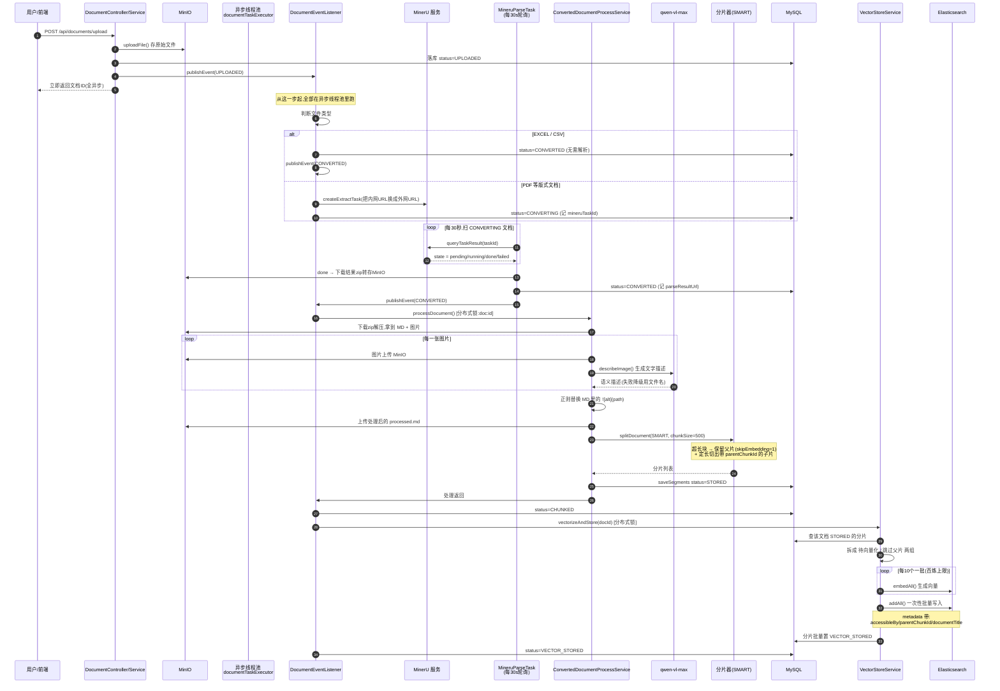

> 这是 LangChain4j 实战系列的第二篇。上一篇我把整个项目的骨架立起来了，这一篇我们扎到两条主线里的第一条——**构建索引**，也就是文档入库流水线，把它从一份 PDF 上传进来，到最终变成可检索的向量，中间每一步都掰开揉碎讲清楚。

## 先把问题说清楚

RAG 的效果，七分靠数据。我在上一篇构建索引那部分也强调过：**无论你后面的检索环节做了多高深的优化，数据源头的质量才是决定最终效果的最重要因素。**

那构建索引这一步，到底难在哪？

难在原始文档是一堆"脏乱差"的东西。一份产品手册的 PDF，里面有排版复杂的表格、有公式、有几十张图片、有一堆没有逻辑的换行。而向量检索能处理的，是一段段干净的、语义完整的文本。你要做的，就是把前者变成后者，而且这个过程：

- **很慢**：解析一份大 PDF，光 MinerU 就要几十秒甚至几分钟，中间还要逐张图片调视觉模型
- **容易断**：任何一步（网络、模型、ES）都可能失败
- **不能重复干**：多实例部署，同一份文档不能被两台机器同时处理

所以我的文档入库，本质上是在解决一个**长耗时的异步流水线该怎么写得可靠**的问题。这一篇我会重点讲三个设计：**事件驱动 + 定时兜底、图片语义化、父子分片**。

## 整个链路的状态机

在陷进代码细节之前，先用状态机把骨架看清楚。一份文档从上传到可检索，`status` 字段会沿着这么一条链路流转：

```
UPLOADED → CONVERTING → CONVERTED → CHUNKED → VECTOR_STORED
```

任何一个环节出错，都会被打断到 `FAILED`。这几个状态分别代表什么：

- **UPLOADED**：文件已经存进 MinIO，数据库落了一条记录，仅此而已
- **CONVERTING**：已经把解析任务丢给 MinerU 了，正在等它出结果（Excel/CSV 不需要这步）
- **CONVERTED**：MinerU 解析完了，拿到了 Markdown 和图片
- **CHUNKED**：图片处理完、文档切完，分片存进了 `knowledge_document_segment` 表
- **VECTOR_STORED**：分片向量化写进 ES 了，到这一步这份文档才真正"可被检索"

这里有个小坑要提一下：建表语句的注释里我写了个 `INIT` 状态，但实际代码从头到尾没有写过 `INIT`，落库第一条记录的状态就是 `UPLOADED`。所以 `INIT` 是个历史遗留的摆设，看代码的时候别被它误导。

分片表 `knowledge_document_segment` 还有它自己的一套小状态：分片存进去时是 `STORED`，向量化完成后变成 `VECTOR_STORED`。父子分片里被标记跳过向量化的父片，也会直接置成 `VECTOR_STORED`（因为它本来就不该进 ES）。

## 完整泳道图

先看全景，再逐个环节拆解。这张图画的是从上传到可检索的完整链路：



图很长，但这就是真实发生的一切。下面我挑里面最有料的地方讲。

## 上传落地：为什么第一件事是"立刻返回"

入口是 `RagKnowledgeDocumentController` 的 `upload` 接口，用户带上文件，外加几个可选参数（`chunkSize` 默认 500、`overlap` 默认 50、`accessibleBy` 默认 STAFF、`expireDate` 等）。

`uploadDocument` 干三件事：调 `MinioService#uploadFile` 把原始文件扔进 MinIO（objectName 是 `yyyy/MM/dd/{UUID去横线}{后缀}` 这种按日期分目录的格式）、判一下文件类型、往数据库落一条 `status=UPLOADED` 的记录，然后 `publishEvent(new DocumentEvent(UPLOADED, document))` 就完事了。

注意，接口到这里就返回了，用户拿到的是一个文档 ID。真正的重活全在事件驱动之后。**为什么不能同步做？** 因为后面 MinerU 解析 + 逐图识别，一份复杂 PDF 跑完可能三五分钟，你让 HTTP 接口挂五分钟等着？肯定不行。所以上传接口只负责"收下 + 记账 + 发车"，剩下的交给异步流水线。

这里还埋了一个细节：`publishEvent` 如果被异步线程池拒绝（`RejectedExecutionException`，池子满了），我会直接 `catch` 住把这条文档标成 `FAILED`。因为事件没发出去，后面所有环节都不会启动，这条文档就"烂"在 UPLOADED 状态了，与其让它卡着，不如明确失败让用户重传。

## 事件驱动机制：核心 4 最大 8，队列 100

整条流水线的"发动机"是 `DocumentEventListener`。它没有用消息队列，而是用 Spring 的 `ApplicationEvent` + `@Async`，我把所有事件的分发收敛到一个方法里：

```java
@Async("documentTaskExecutor")
@EventListener
public void onDocumentEvent(DocumentEvent event) {
    switch (event.getType()) {
        case UPLOADED       -> handleDocumentUploaded(event);
        case CONVERTED      -> handleDocumentConverted(event);
        case CHUNKED        -> handleDocumentChunked(event);
        case VECTOR_STORED  -> handleDocumentVectorStored(event);
        case FAILED         -> handleDocumentFailed(event);
    }
}
```

每种事件处理完，成功就 `publishEvent` 下一个阶段的事件，失败就发一个 `FAILED` 事件，形成一条链式反应。你可以看到 UPLOADED → CONVERTED → CHUNKED → VECTOR_STORED 正好对应状态机的推进。而且每个阶段我都顺手埋一个 `ragMetrics.recordPipelineStage(stage, true/false)`，入库哪个环节挂得多，Prometheus 上一目了然。

**为什么不用 MQ？** 这是我被问得最多的一个问题。我的考量是：这个项目的规模和部署形态（单机或小规模多实例），引入 Kafka/RocketMQ 的运维成本和心智负担，是大于它带来的收益的。Spring 事件 + 线程池足够把这条异步链路跑起来。那 MQ 能解决的"消息不丢"问题怎么办？我用另一套机制补——就是下面要讲的定时兜底。

线程池是自己在 `AsyncConfig` 里配的：核心 4、最大 8、队列 100、`keepAlive` 60 秒，线程名前缀 `doc-event-`，拒绝策略我改成了"记日志 + 抛 `RejectedExecutionException`"（而不是默认的丢弃或调用方执行），这样发布方能感知到并标 FAILED。优雅关闭时等 30 秒把在途任务跑完。

## CONVERTING 这一段：为什么是轮询而不是回调

`handleDocumentUploaded` 里有个分叉：

```java
if (fileType.equals(FileType.EXCEL) || fileType.equals(FileType.CSV)) {
    document.setStatus("CONVERTED");           // Excel/CSV 不需要解析,短路
    eventPublisher.publishEvent(CONVERTED事件);
} else {
    // 其他类型走 MinerU
    String externalFileUrl = document.getFileUrl()
            .replace(minioService.getInternalEndpoint(), minioService.getExternalEndpoint());
    String taskId = mineruService.createExtractTask(externalFileUrl);
    document.setMineruTaskId(taskId);
    document.setStatus("CONVERTING");
}
```

两个点值得说。

第一个是 Excel/CSV 短路。这类文件本身就有规整的结构，不需要 MinerU 这种版式解析服务，直接标 `CONVERTED` 进下一步，省掉整个 CONVERTING 阶段。

第二个是那行 `replace(internal, external)`，这是个实打实的坑。MinIO 返回的文件地址是内网地址（比如 `http://localhost:9000` 或容器内的 host），但 MinerU 是跑在外网的第三方服务，它根本访问不到你的内网 MinIO。所以提交解析任务前，必须把 URL 的 host 部分换成一个 MinerU 能访问到的外网地址（`external-endpoint`）。这个我在配置里内网外网分开配，踩过一次就记住了。

**然后是轮询还是回调的问题。** MinerU 给的是"提交任务拿 task_id，然后你去查"的异步模式，没有可靠的回调机制推结果给我。所以我写了个 `MineruParseTask`，`@Scheduled(fixedDelay = 30000)` 每 30 秒扫一遍所有 `CONVERTING` 状态的文档，挨个拿它的 `mineruTaskId` 去查结果：

```java
switch (state) {
    case "done"   -> handleTaskDone(document, result);    // 下载zip转存,标CONVERTED,发事件
    case "failed" -> handleTaskFailed(document, result);  // 发FAILED事件
    default       -> log.info("仍在处理中: {}", state);     // pending/running 继续等
}
```

`done` 之后，结果是一个 zip（`full_zip_url`），我把它下载下来再转存进自己的 MinIO（不能直接依赖 MinerU 那个临时下载链接，它会过期），记到 `parseResultUrl`，状态推到 `CONVERTED`，发出 CONVERTED 事件，流水线继续往下走。

对了，这里还有个小 bug 我修了但留了个提醒：`queryTaskResult` 的注释里我当时写的是完成态叫 "completed"，但 MinerU 实际返回的是 "done"，`switch` 匹配的是 "done"。以代码为准，别看注释。

## CONVERTED 之后：图片语义化 + 父子分片

CONVERTED 事件触发 `ConvertedDocumentProcessService#processDocument`，这是整条流水线最"重"的一步，也是我认为对入库质量影响最大的一步。方法上挂了 `@DistributeLock(scene="document_process", key="#document.id")`，防止多实例并发处理同一文档。

它内部按文件类型分三条路：Excel 因为是二进制，直接下原始字节丢给 `ExcelSplitter`（不能过 String 转换，否则二进制会损坏）；CSV 虽然是文本但也走 `ExcelSplitter`；其余类型才走标准的"解析结果处理 + Markdown 切分"。

我们以最有代表性的 PDF 路径来看。

### 图片语义化

`processMineruResult` 把 zip 下载解压，分离出那个 `.md` 文件和一堆图片文件（顺手跳过 `__MACOSX` 和隐藏文件）。然后对每一张图片做两件事：上传到我自己的 MinIO 拿到稳定 URL，再调 `BailianImageService#describeImage`（底层是 qwen-vl-max）生成一段文字描述。

**为什么要给图片生成文字描述？** 因为向量检索是看不见图片的。MinerU 解析出来的 Markdown 里，一张图就是一行 ``，你对着它 embedding，得到的全是无意义的字符。但这段文字描述（"这是一张系统架构流程图，左边是网关，中间是三个微服务……"）是能被检索到的。这样用户问"我们的网关是怎么设计的"，才有可能命中一张本来只是图片的架构图。

拿到描述后，用正则把 Markdown 里的图片引用替换掉：

```java
private static final Pattern IMAGE_PATTERN =
    Pattern.compile("!\\[([^]]*)]\\(([^)\\s]+)(?:\\s+\"([^\"]*)\")?\\)");
// 把  替换成 
```

替换的时候还处理了相对路径和文件名匹配的问题（zip 里的路径前缀和 MD 里引用的可能不一致），支持精确匹配 + 文件名兜底匹配。**识别失败怎么办？降级用文件名当描述**，绝不让一张图的识别失败拖垮整篇文档的处理。

处理完的 Markdown（图片已经是"文字描述 + 稳定 URL"了）再上传一份成 `processed.md`，记到 `processedMdUrl`，这就是后续切分和展示的干净数据源。

### 父子分片（Small-to-Big）

然后是切分。`splitDocument` 固定用 `SplitType.SMART`，`chunkSize` 和 `overlap` 从文档自身配置读（没有就 500 / 50）。SMART 底层是 `MarkdownHeaderParentTextSplitter`，它会先按 Markdown 的标题层级（# 到 ######）把文档切成逻辑块，然后再对每个块做一次关键处理，就是我上一篇反复提到的父子分片。核心逻辑在 `splitByChunkSize`：

```java
if (content.length() <= chunkSize) {
    result.add(segment);                        // 没超长,原样保留
} else {
    // 超长,二次切割
    String parentChunkId = IdUtil.getSnowflakeNextIdStr();
    fullMetadata.put(CHUNK_ID, parentChunkId);
    fullMetadata.put(SKIP_EMBEDDING, 1);        // 父片保留完整内容,但跳过向量化
    result.add(完整父片);

    while (start < content.length()) {          // 按 chunkSize 定长切子片
        subMetadata.put(CHUNK_ID, 新的雪花ID);
        subMetadata.put(PARENT_CHUNK_ID, parentChunkId);  // 子片指向父片
        result.add(子片);
    }
}
```

**这套设计想解决什么两难？** 切片这件事，永远是"检索精度"和"上下文完整"的博弈：

- 切得小（比如 500 字一片），向量检索很准，命中的就是那一小段精确内容——但给大模型的上下文太碎了，模型看到的是一句话的半截。
- 切得大（整节几千字一片），上下文完整了——但向量检索命中一个巨大的块，塞进 prompt 全是无关信息，还费 token。

父子分片就是两全其美：**向量库里存的、用来被检索命中的，是小子片（保证"查得准"）；一旦命中子片，顺着 `parentChunkId` 回溯出那一片完整的父片喂给大模型（保证"上下文全"）。** 而父片因为只是拿来当上下文的，压根不需要进向量库，所以标了 `skipEmbedding=1`。

顺带一提，还有个 `MarkdownHeaderBrotherTextSplitter` 兄弟分片模式（命中一片，把同级的兄弟片也聚合带上），我已经实现了，但目前没接进工厂，属于留给后面的能力。这块的检索回溯我放在问答篇再细讲，这里你只要记住：**入库时给每个超长块都埋好了 `parentChunkId` 这条线，就等着检索时拽出来。**

切完的所有分片，`saveSegments` 落库，每片一个雪花 `chunkId`、`chunkOrder` 从 1 开始、状态 `STORED`，`skipEmbedding` 从元数据里透传，metadata 序列化成 JSON 存着（docId、documentTitle、docFileUrl 都在这里补进去）。

## CHUNKED 之后：向量化写 ES

CHUNKED 事件里，先把文档状态更新为 CHUNKED，然后调 `VectorStoreService#vectorizeAndStore`（又一层 `@DistributeLock`，key 是文档 ID），成功后发 VECTOR_STORED 事件，最后一个 handler 把状态定到 VECTOR_STORED。

`vectorizeAndStore` 做几件事：

1. 捞出这个文档所有 `status=STORED` 的分片；
2. 按 `skipEmbedding` 分成"要向量化的子片/普通片"和"跳过的父片"两组；
3. 给每个要处理的片构建 ES metadata，除了 chunkId、documentId、chunkOrder，重点写了两个：`documentTitle / docFileUrl`（后面引用展示用）和 **`accessibleBy`**（这是权限过滤的关键，见下面）；
4. **分批 embedding**，`batchSize = 10`；
5. 所有向量攒齐后 `store.addAll()` **一次性批量写 ES**；
6. 分片批量更新成 VECTOR_STORED。

两个地方值得展开。

**为什么 batch=10？** 因为百炼的 `text-embedding-v3` 单次请求最多 10 条，超过就报错，这是硬约束。而写 ES 我反而攒到最后一次性批量写，因为 ES 的 bulk 写入，一次写 100 条比写 10 次 10 条要省太多网络往返。

**为什么要把 accessibleBy 写进 ES 元数据？** 因为我的权限过滤是在检索的应用层做的。入库时，我就把这份文档"谁能看"（VISITOR / CUSTOMER / STAFF）写死进了 ES 每条向量的 metadata 里。等你检索的时候，把 `metadata.accessibleBy` 取出来，对照当前用户等级过滤就行，**不用回 MySQL 做 join**，检索链路是纯 ES 内闭环的。

这里有个我自己踩过的坑，特意在代码里留了注释。ES 结果里，**只要某条命中丢失了 metadata（或者 metadata 里没有 accessibleBy），我一律按"最高密级、仅 STAFF 可见"处理**，而不是放行。原因很简单：权限过滤的默认值必须是"拒绝"而不是"允许"。如果你因为某条链路的疏漏没带上 accessibleBy 字段，结果却默认放行，那就等于给受限文档开了个后门。宁可少召回，也不能越权。

还有一点：`vectorizeAndStore` 挂在整个链路的末端，它前面已经查过、切过、向量化过了，如果因为某次 ES 抖动失败了，靠的就是下面要讲的兜底定时任务把它捞回来。

## 兜底定时任务：可靠性真正的守门员

事件驱动快，但它有个天生弱点：只要应用在"发了事件、但下一步还没处理完"的空档里重启，这条链路就断了，文档会永远卡在中间状态。为此我配了两个纯兜底的定时任务，它们不参与主链路（主链路是事件驱动的），只负责"捡"那些卡住的文档重跑：

- `ConvertedDocumentProcessTask`，`@Scheduled(fixedDelay = 300000)`，每 5 分钟扫卡在 `CONVERTED` 的文档，重放 `processDocument` 并发 CHUNKED 事件（补上图片处理+切分这段可能丢失的执行）。
- `VectorStoreTask`，同样每 5 分钟扫卡在 `CHUNKED` 的文档，重放 `vectorizeAndStore`，补做向量化。

加上前面 MinerU 那个每 30 秒的 `MineruParseTask`，一共三个定时任务。你可以这么理解整个可靠性模型：**主链路靠事件驱动（追求快），可靠性靠状态 + 定时扫描重放（追求稳），两者配合，最终一致。** 失败不置状态、下一轮自动重试，而且所有重放都被 `@DistributeLock` 兜着，不会和事件驱动的那次执行撞车。

## 分布式锁：多实例下的防重

前面反复提到 `@DistributeLock`。这是我自己写的一个注解 + 切面（`DistributeLockAspect`），底层是 Redisson：

```java
@DistributeLock(scene = "document_process", key = "#document.id")   // key 支持 SpEL
@DistributeLock(scene = "vectorizeAndStore", key = "#documentId")
```

切面里用 `redissonClient.getLock(scene + "#" + key)` 拿到锁，SpEL 解析出真实的文档 ID 作为 key。默认不指定超时，直接 `lock()`，靠 Redisson 的看门狗自动续期（处理很慢的文档也不怕锁提前释放）；如果显式配了 `waitTime` 就走 `tryLock`。拿不到锁就抛 `DistributeLockException`。

为什么锁粒度是文档 ID 而不是全局？因为我要的就是"不同文档可以并行处理，但同一份文档任何时刻只能被一个节点碰一次"。事件驱动那次和定时重放那次，天然可能在同一时间盯上同一份 CONVERTED 文档，这把锁就是让它们排队。

## 小结

这一篇我们把文档入库这条流水线从头走到尾，几个我想让你记住的点：

- **它是异步的、事件驱动的**，长链路绝不能压在一个 HTTP 请求上同步等。
- **可靠性是"事件驱动 + 定时兜底"双保险**换来的，不靠 MQ 也能做到最终一致。
- **图片语义化**把"看不见的图"变成"可检索的文字"，是从源头提质量的关键一招。
- **父子分片**用 `skipEmbedding` 和 `parentChunkId` 这对元数据，同时拿到了"检索准"和"上下文全"。
- **`accessibleBy` 写进 ES metadata + 权限过滤默认拒绝**，让多租户的文档隔离在纯检索链路里就能生效。

下一篇我们走另一条主线——**检索生成**，把用户提问后"改写 → 意图路由 → 混合检索 → 重排 → 父子回溯 → 流式生成带引用答案"这一整条链路拆开讲，那才是真正见 RAG 功力的地方。感兴趣的关注我，有问题评论区聊。
