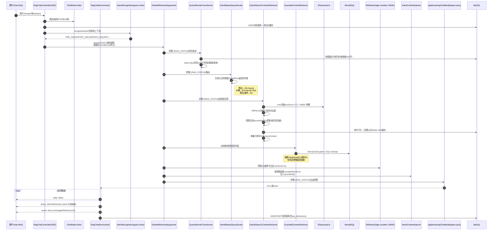

> LangChain4j 实战系列第三篇，也是我认为最见功力的一篇：**检索生成**。前两篇我们把项目骨架和文档入库讲完了，知识已经"存"进去了，这一篇解决另一半问题——用户开口提问之后，系统怎么把对的知识、以对的形式、稳定地送到模型面前，再把答案流式吐回去。

## 先摆问题

一个最朴素的 RAG 实现是这样的：用户问题 → embedding → 向量库找 Top-K → 塞进 prompt → 模型回答。能跑，但你真拿自己的业务去试几下，马上会发现三个问题：

**第一，用户不会"好好提问"。** 我们的业务是一个面料撮合交易平台，用户真实的问题长这样："这个多少钱一公斤？""它有什么缺点？"——单独看这句话，什么信息都没有。不带上下文去检索，召回的全是垃圾。

**第二，纯向量检索"查得广但查不准"。** 面料行业一堆专业术语，"32支精梳全棉""不倒绒""奥代尔拉架"，向量模型对这些词的语义表征未必可靠，经常给你召回一堆"看起来相关"但其实没用的段落。反过来，精确的订单号、货号这类关键词，语义检索又经常漏。

**第三，链路太长，哪一环都可能抽风。** 改写要调模型、检索要打 ES、图检索要走 Neo4j、重排要跑本地模型、生成要等大模型首 token。任何一环慢了挂了，用户看到的就是一个转圈的聊天框。

我的整条检索生成链路，就是围绕这三个问题设计的。先看全景，再逐段拆。

## 完整链路泳道图

入口是 SSE 流式接口 `POST /api/chat/conversations/{id}/messages/stream`：



整条链路严格来说是 LangChain4j 的 `DefaultRetrievalAugmentor` 在驱动：**Transformer → Router → Retriever → Aggregator → Injector → 模型**，我做的事情就是把这五个插槽每个都换成自己的实现。下面挨个讲。

## 意图识别：花小钱办大事

第一个设计决策：**在检索之前，先花一次极便宜的模型调用，判断用户到底想干什么。**

用的是一个独立的 `@AiService`，模型配的是最便宜的 `qwen-turbo`，记忆用的是独立的 `intentChatMemoryProvider`（窗口 10 条，和业务对话记忆完全隔离）：

```java
@AiService(wiringMode = AiServiceWiringMode.EXPLICIT,
        chatModel = "titleChatModel",
        chatMemoryProvider = "intentChatMemoryProvider")
public interface IntentRecognitionService {
    @SystemMessage("""
            你是一个面料撮合交易平台的用户意图识别助手。...
            分类为以下五种意图之一：
            - PRE_SALES：面料咨询、找布需求、面料推荐、样品索取...
            - POST_SALES：退换货、质量问题、物流查询、投诉...
            - PRICE_INQUIRY：价格查询、报价请求、大货价/剪版布价格...
            - SYSTEM_OPERATION：平台使用方法、功能操作指引、账号问题...
            - GENERAL：与面料交易无关的日常聊天
            ...只输出枚举名称，不要输出任何其他内容。""")
    @UserMessage("用户消息：{{userMessage}}")
    ChatIntent recognizeIntent(@MemoryId String conversationId, @V("userMessage") String userMessage);
}
```

几个心得：

- **prompt 里塞例子比讲道理管用。** 我在分类规则后面跟了十来个真实样例（"精棉苏绒大货价多少钱一公斤？"→ PRICE_INQUIRY，"你好"→ GENERAL），小模型的分类准确率肉眼可见地稳了。
- **只让它输出枚举名。** 下游是 `ChatIntent` 枚举解析，多一个字的废话都会增加解析失败的面积。
- **框架自动带上下文。** `@MemoryId` 一挂，这个会话的历史就自动进来了，"这个多少钱"这种指代性提问，模型看着上文就能判对是 PRICE_INQUIRY。

意图识别完全失败怎么办？`RagChatServiceImpl` 里包了一层 `recognizeIntentSafely`，异常直接降级 `GENERAL`——宁可让用户得到一句没有知识库支撑的普通回答，也不让"分类"这个前置动作把整个请求卡死。

## 查询改写：把"它有什么缺点"变成能检索的话

意图管"走哪条路"，改写管"用什么词去查"。`QueryRewriteTransformer` 实现的是 LangChain4j 的 `QueryTransformer` 接口，核心就三件事：

1. 从库里捞出该会话最近 **3 轮**对话（`HISTORY_TURNS * 2` 条消息，每条内容截 100 字，拼成"用户：xxx / 助手：xxx"的文本）
2. 有历史用带历史的 prompt，没历史用无历史的 prompt，共同要求是：**提取核心意图、用更专业的术语、不超过 20 个字、直接输出结果不要解释**
3. 改写为空或抛异常，一律**回退原始查询**

效果就是注释里那两个例子：

- 上文聊过"帮我找32支精梳全棉的卫衣布料" → 用户问"这个多少钱" → 改写成 **"32支精梳全棉卫衣布料 价格"**
- 上文聊过"有没有不倒绒的供应商" → 用户问"它有什么缺点" → 改写成 **"不倒绒面料 缺点 特性"**

这里有个克制的地方我挺满意：**只返回一个改写后的 Query，不做多查询扩展。** 多路扩写听起来美好，但每多一个 query 就是把检索成本乘一遍，而且多个改写版本之间还会互相稀释重排的效果。我现在的场景里，改写准了，一个就够了。

## 意图路由与 ThreadLocal 的坑

`IntentBasedQueryRouter` 实现 `QueryRouter`，拿意图查映射表选检索器组合。GENERAL 直接返回空列表——**不检索，就是最快的检索**。未配置的意图和一切异常，统一兜到 PRE_SALES 的组合，保证"有得查"。

但这里藏着一个我踩过的小坑：**意图在 Controller 层已经识别过一次了，管道内部 Router 还要用，难道再花一次模型调用？** 当然不行。我的做法是搞了一个 `IntentContextHolder`（ThreadLocal），主流程把意图、conversationId、userType 三个东西设进去，Router 先 `getIntent()`，有就直接复用：

```java
ChatIntent intent = IntentContextHolder.getIntent();
if (intent == null) {
    intent = intentRecognitionService.recognizeIntent(conversationId, query.text());
}
```

为什么这个 ThreadLocal 能一路传下去？因为 `DefaultRetrievalAugmentor` 的管道是**同步**执行的，改写、路由、检索、注入全在同一个线程里跑完（我把整个管道包在虚拟线程里）。管道终点在 `IntentContentInjector` 的 `finally` 里统一 `clear()`——**ThreadLocal 不清理，线程一复用，上一个用户的意图就漏给下一个用户了**，这种 bug 查起来能让人怀疑人生。

路由映射表本身在 `RagConfig` 里装配：

- PRE_SALES → [ES 混合检索, Neo4j 图检索]
- POST_SALES / SYSTEM_OPERATION → [ES]
- PRICE_INQUIRY → [ES, Neo4j, SQL]

价格为什么要走三路？因为"大货价""剪版布价"这种数据，一部分在合同文档里（ES），一部分是结构化的价格表（SQL text2sql 去查表比查向量准得多），一部分是"面料-供应商-报价"的关系（Neo4j）。让数据待在它最该在的地方，检索的事交给路由。

## 混合检索：两路召回 + 应用层 RRF

这是链路的腰眼。`HybridSearchContentRetriever` 把 ES 一次打两枪：

```java
// 1. 向量语义检索：knn，带 minScore
EmbeddingSearchRequest request = EmbeddingSearchRequest.builder()
        .queryEmbedding(queryEmbedding)
        .maxResults(fetchSize)
        .minScore(minScore)      // 0.7
        .build();
EmbeddingSearchResult<TextSegment> vectorResult = store.search(request);

// 2. BM25 关键词检索：match text 字段
List<Bm25Hit> bm25Hits = executeBm25Search(query, fetchSize);

// 3. 应用层 RRF 融合，k = 60
double rrfScore = 1.0 / (rrfK + rank + 1);
rrfScores.merge(text, rrfScore, Double::sum);   // 同一段文本两路都命中,分数相加
```

**为什么在应用层手写 RRF，不用 ES 自带的？** 因为 ES 原生 RRF 是白金版以上才给的功能，我用的基础许可没有。而 RRF 这算法本身简单得要命——谁排得靠前谁的 `1/(k+rank)` 大，两路都命中的直接加分，按文本内容做 key 去重——应用层十几行就写了，还不绑版本。

**BM25 那一路挂了怎么办？** 我的 `executeBm25Search` 里整个包了 try-catch，失败就返回空列表，退化成纯向量检索。同理向量那路也有 minScore 0.7 卡着低质量命中。**混合检索的优雅之处在于：任何一路失灵，系统自动退回单路，而不是整个报错。**

**权限过滤和超量召回的坑，重点说。** 检索结果按 metadata 里的 `accessibleBy` 过滤，但过滤这件事有个陷阱：你是先截断 topK 再过滤，还是先过滤再截断？顺序错了，低权限用户搜出来的东西会被无权文档"白占名额"截得七零八落。我的做法是**超量取回 3 倍（`PERMISSION_OVERFETCH = 3`），先融合、再权限过滤、最后才截断到 topK=5**。还有一个安全细节前面入库篇讲过：metadata 缺失或没有 accessibleBy 的结果，一律当最高密级处理只放行 STAFF，**权限的默认值必须是拒绝**。

## 父子回溯与引用收集

粗召回之后还有一步兑现入库篇埋的伏笔：命中子片，回溯父片。`resolveParentChunks` 的逻辑：

```java
// 1. 收集命中子片的 parentChunkId
// 2. 批量拿父片内容: Redis(rag:parent_chunk:{id}, TTL 24h) 优先, miss 回查 DB 并回填
// 3. 移除命中的子片 + 结果里所有同父的兄弟片
// 4. 父片以固定 score=1.0 插回结果
```

**为什么要连兄弟片一起移除？** 想一个场景：一段 2000 字的父片切成 4 个子片，向量检索一下命中了其中两个子片，这俩子片的父片是同一个。你回溯出父片之后，如果原来那两条子片还在结果里，等于**同一段内容在 prompt 里出现三遍**，token 白烧。所以同父的全部子/兄弟片干掉，只留一份父片，score 给 1.0（它已经是最完整的上下文了，排最前）。

父片内容走 Redis 缓存，是因为同一个热文档的父片会被反复回溯，别每次都回 MySQL 捞 LONGTEXT。

同时，这一步还会把命中的文档按 documentId 去重、取最高分，写进 `ReferenceContext`——这就是最后"引用来源"的数据底座。

## 重排序与内容注入

聚合环节用 LangChain4j 现成的 `ReRankingContentAggregator`，底下垫的是 `OnnxScoringModelHolder` 加载的 **bge-reranker-v2-m3 量化版**（`resources/bge/` 里的 onnx + tokenizer，启动时解到临时目录，maxTokens 8192）。cross-encoder 把 query 和每个候选拼在一起打分，比向量那种"各算各的"精确得多。

一个参数选择说下理由：重排 `minScore` 我配的是 **0.0**，也就是**只重排、不按重排分过滤**。过滤阈值是特别依赖场景的超参，我不想让一个我调不准的数字悄悄杀掉本可以用的内容。要不要用，交给模型自己判断。

最后注入环节，`IntentContentInjector` 干的事：按 ThreadLocal 里的意图加载对应模板文件，把检索内容格式化成"【内容 1】…"分节（一条都没有就填"（未检索到相关内容）"），替换 `{{contents}}` 和 `{{userMessage}}`，返回一个新的 `UserMessage`：

```java
String promptTemplate = loadPromptTemplate(intent);   // classpath:/prompt/pre_sales.txt
String finalPrompt = promptTemplate
        .replace(CONTENTS_PLACEHOLDER, formattedContents)
        .replace(USER_MESSAGE_PLACEHOLDER, userMessageText);
return UserMessage.from(finalPrompt);
```

**每个意图一个 prompt 文件**，售前的讲"推荐要带克重成分报价区间"、售后的讲"先安抚再给流程"、价格的讲"只报库里的数不许编"——这些我放在 resources/prompt/ 下慢慢调，改模板不用动代码。模板缓存进 `ConcurrentHashMap`，但有个刻意的设计：**加载失败时返回内置默认模板，且不写入缓存**——不然某次瞬时 IO 故障，就把一个兜底模板永久缓存住了。

## 流式生成、SSE 事件协议与记忆

装配到 `KnowEngineChatAiService` 里跑的模型是 `qwen-plus` 流式版（超时 120s），返回 `Flux<String>`。主服务订阅它，每个 token 经 `SseEmitter` 推给前端。这里我把 SSE 定义成了一个小小的协议，一共四类帧：

- 普通 `data:` 帧 —— 答案 token，前端直接追加渲染
- `[RAG_STATUS]{step,totalSteps,title,...}` —— 管道进度（改写/路由/检索/生成四步），前端渲染成步骤条，缓解等待焦虑
- `[RAG_REFERENCES]{json}` —— 答案讲完先推这个，引用文档列表（去重、最高分、降序），前端进侧栏
- `event: done` —— 收尾元数据（messageId、用的模型、token 数）

`RagStatusContext` 的原理也是 ThreadLocal：主流程把"发射函数"设进去，管道深处每步 `emitStatus(...)` 就能直接把进度打到这个请求的 SSE 通道上。

弹性上最后强调一次那个流式的特殊处理：`ResilientStreamingChatModel` **只熔断、绝不重试**。同步调用失败了重试没事，流式都吐了一半 token 了你重试，用户就看到半截话重复播一遍。熔断上报也是手动 `tryAcquirePermission` + 在 onComplete/onError 时拿**整段流的实际耗时**去记账（AtomicBoolean 保证只记一次），因为"首 token 秒回但中途卡死"这种情况，按调用发起时间算根本不准。

记忆用 `DbBackedChatMemory`（窗口 20 条），`messages()` 直接倒序查 `rag_chat_message` 再反转，`add()` 是**空的**——持久化统一由主服务落库负责，记忆的写路径只有一条，就不会出现两边状态对不齐。读频繁就垫了个 Redis 60s 的 `ChatMemoryCache`，新消息落库后主动 evict。

## 小结

检索生成这条链路，我总结成三句话：

- **问的准**：意图识别定路线，查询改写补指代，都是在花小钱换检索质量。
- **查得全又掐得细**：knn + BM25 双路 RRF 融合、bge 精排、子片命中父片回填、权限过滤超量取回先滤后截，每一层都在修上一层的盲区。
- **塌不了**：每个组件失败都有明确的降级去向——改写失败用原查询、识别失败当 GENERAL、Neo4j 挂了走 ES、BM25 挂了走纯向量、检索超时 5 秒切空结果。管道保证永远有输出，只是输出的"知识浓度"会波动。

而且你会发现 LangChain4j 的插槽式抽象在里面起了很大作用：Transformer、Router、Retriever、Aggregator、Injector，我五个实现全是往标准接口里填自己的逻辑，想换哪个拔哪个。这就是我第一篇结尾说的，从"好用"往"可扩展"走的那一步。

至此三条主线里的两条主线（入库、检索生成）都讲完了。最后一篇番外，我打算聊聊这个项目的可观测和限权：rag 指标怎么埋、Prometheus 看什么、以及 Sa-Token + 三级用户 + accessibleBy 下沉 ES 这一整套权限是怎么串起来的。感兴趣关注不迷路，评论区见。
