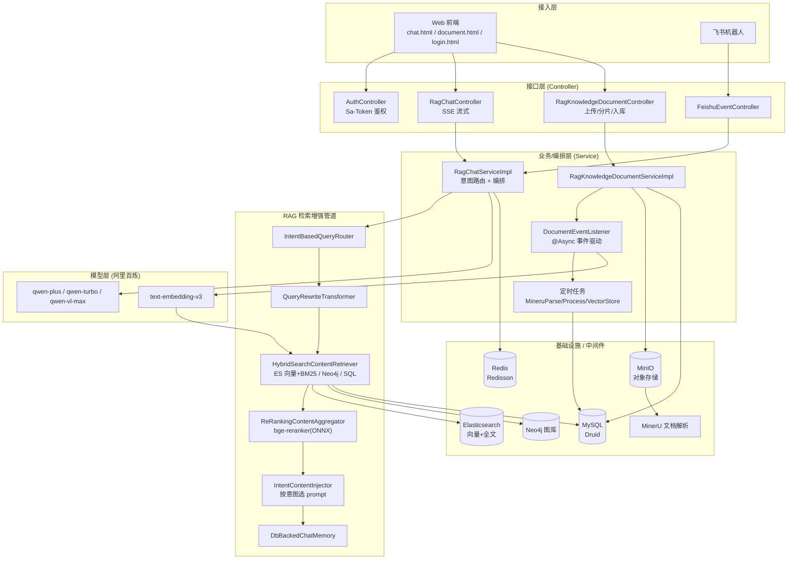
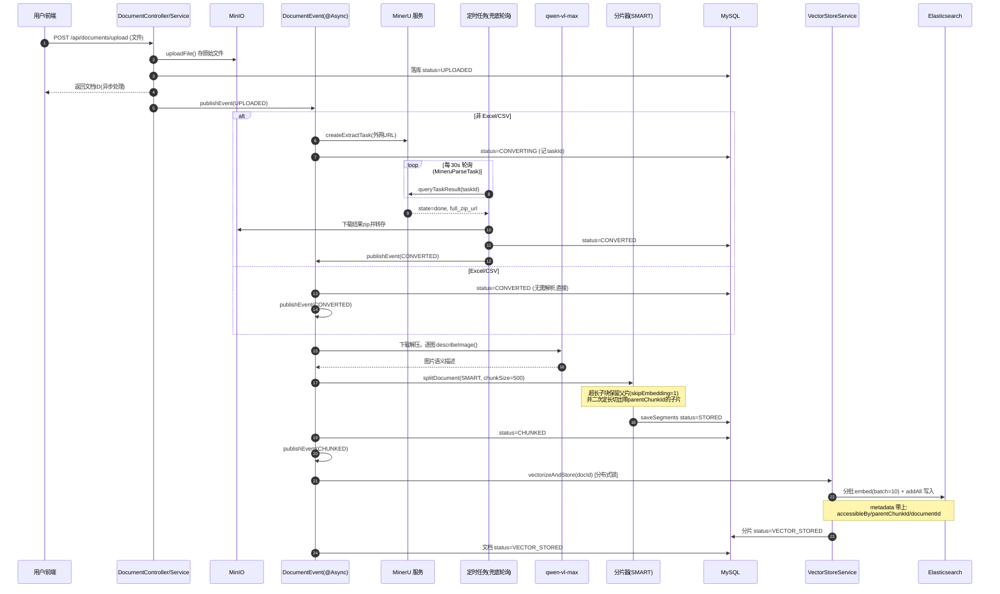
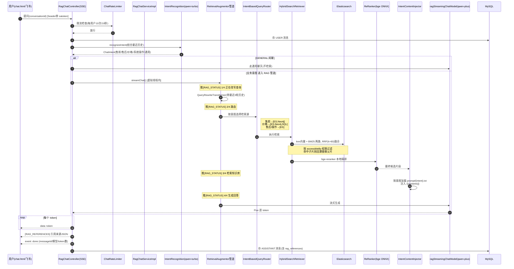

> 这是我 LangChain4j 实战系列的开篇，先把整个项目的全貌讲清楚：这个项目是干嘛的、用到了哪些技术和中间件、是怎么引入和使用的、以及从一份 PDF 上传进来，到你提一个问题拿到带引用来源的回答，中间到底经历了什么。

## 这个项目是干嘛的

上一篇文章里我讲过，RAG 的核心就是 检索 + 生成，模型不再"凭自身经验瞎说"，而是"查完资料再说"。

那这篇文章，就是我把自己按照这个思路落地的一个完整项目，拿出来做一次全盘拆解。

简单来说，这个项目做的是：**把企业里散落的文档（PDF、Word、PPT、Excel、图片等）自动加工成一个可检索的知识库，然后以一个能理解意图、会引用来源、支持多轮对话的 AI 问答助手对外提供服务。**

市面上的 demo 大多是"接个大模型 API，套个聊天框"，但真要把 RAG 用到生产环境，你会发现一堆问题等着你：

- 一份带图表、带公式的 PDF，怎么变成机器能检索的知识？
- 文档太大不能整个喂给模型，切片怎么切才不破坏语义？
- 单纯向量检索召回不准怎么办？
- 大模型时不时抽风超时怎么办？
- 不同级别的员工能看到的文档不一样，权限怎么控制？
- 用户随口一句"这个多少钱"，系统怎么知道该去查知识库还是查价格表？

我这个项目就是冲着这些问题去的，整个项目可以拆成三条主线：

- **文档入库**：把原始文件加工成向量索引，对应我之前说的"构建索引"环节
- **RAG 问答**：用户提问时的检索生成全链路，对应"检索生成"环节
- **多端接入**：Web 端流式对话 + 飞书机器人，外加一套用户等级权限过滤

下面我按一个项目从零开始的顺序，一步步讲。

## 前期准备工作

在写第一行代码之前，得先把地基打好。这一步很多新手喜欢跳过，结果就是后面各种启动报错。

### 运行时环境

- JDK 21：项目里用到了不少虚拟线程（比如 `Thread.startVirtualThread`），必须 21 起步，这个没得商量
- Maven 3.8+：项目自带 mvnw，不想装 Maven 也行
- IDEA：记得装 Lombok 插件，不然满屏红线

Spring Boot 用的是 3.5.6：

```xml
<parent>
    <groupId>org.springframework.boot</groupId>
    <artifactId>spring-boot-starter-parent</artifactId>
    <version>3.5.6</version>
</parent>
<properties>
    <java.version>21</java.version>
</properties>
```

### 需要提前拉起的中间件

这个项目算是个"重中间件"项目，本地开发前，下面这些服务得先用 Docker 或者本地安装的方式跑起来：

- **MySQL 8.x**：存业务数据、文档、分片、会话、消息，地址 `localhost:3306`
- **Redis**：分布式锁、限流、会话缓存，地址 `localhost:6379`
- **Elasticsearch 9.x**：向量存储 + BM25 全文检索，是我们混合检索的主力，地址 `localhost:9200`
- **MinIO**：对象存储，存原始文件、解析结果、图片，地址 `localhost:9000`
- **Neo4j**（可选）：图数据库，给售前咨询、价格类问题做关系检索，`bolt://localhost:7687`

这里有个坑要提一下：ES 的 Java 客户端版本要显式覆盖到 9.3.1，去匹配 `langchain4j-elasticsearch 1.19.0-beta29` 的编译依赖，版本对不上启动就会报错，我是在 pom 的 dependencyManagement 里强制指定的。

数据库建好库之后，直接执行项目里的 `init.sql` 就行，它会把 6 张核心表建好，还会插一个测试客服账号（手机号 13800138000，密码 123456，类型 STAFF），方便我们本地登录调试。

### 大模型和外部服务账号

模型的部分我全部走的阿里百炼（DashScope）的 OpenAI 兼容端点，申请一个 API Key 配好 base-url 就能用：

- `qwen-plus`：RAG 答案生成 + 通用闲聊
- `qwen-turbo`：意图识别、会话标题摘要这种轻量任务，用便宜快的模型
- `qwen-vl-max`：视觉模型，用来给文档里的图片生成文字描述
- `text-embedding-v3`：向量化模型，注意它单次批量上限是 10 条，我代码里 embedding 就是按 10 一批发的

还有两个外部服务：

- **MinerU**（mineru.net）：负责把 PDF/Word/PPT 这类版式复杂的文档解析成 Markdown 并抽取出图片，需要去注册拿一个 token
- **飞书开放平台**（可选）：要接飞书机器人的话，需要 app-id、app-secret、verification-token 这一套

### 内置的本地重排序模型

这个是我项目里一个比较特别的设计：我在 resources 里内置了一个 ONNX 量化版的 bge-reranker 重排序模型：

```
src/main/resources/bge/model_quantized.onnx
src/main/resources/bge/tokenizer.json
```

启动的时候由 `OnnxScoringModelHolder` 把它解压到临时目录加载。检索粗召回之后，会用这个模型对候选片段做精排。它是本机推理，不依赖任何外部 API，不花一分钱 token 费用，延迟也可控。之前讲重排序的时候说过这是"精筛选"，我自己实测下来，加了这一层之后进入提示词的文档质量提升很明显。

### 配置文件

所有配置都在 `application.yml` 里，数据源、Redis、ES、MinIO、Neo4j、百炼 Key、MinerU token、飞书配置、还包括 RAG 的一些策略参数（检索超时、限流阈值、记忆缓存 TTL）。

提醒一句：这里的 API Key、各种密码千万别提交进公开仓库，我这份是本地开发配置，发出来的时候都已经换掉了，大家clone下来记得填自己的。

## 我们用到的技术栈，分别是怎么引入、怎么用的

这一节我把项目里的依赖从上到下过一遍，每个都讲一下引入方式和它在这个项目里承担的角色。

### LangChain4j

这是整个项目的核心框架，版本用 BOM 统一管理：

```xml
<dependency>
    <groupId>dev.langchain4j</groupId>
    <artifactId>langchain4j-bom</artifactId>
    <version>1.19.0</version>
    <type>pom</type>
    <scope>import</scope>
</dependency>
```

然后按需引入各个模块：

- `langchain4j` / `langchain4j-open-ai`：核心抽象和 OpenAI 协议对接（百炼兼容端点就走这个）
- `langchain4j-elasticsearch`：把 ES 当向量存储用
- `langchain4j-community-neo4j-retriever`：Neo4j 图检索，Text2Cypher
- `langchain4j-experimental-sql`：Text2SQL 检索，价格咨询类问题会走这条路
- `langchain4j-onnx-scoring`：加载本地 ONNX 重排模型
- `langchain4j-reactor`：把流式生成适配成 Flux，配合 SSE 推给前端

LangChain4j 我最喜欢的就是 AiServices 这个声明式抽象，一行注解就把"模型 + 记忆 + 检索增强器"拼装成了一个完整的 RAG 问答服务：

```java
@AiService(
    chatModel = "ragChatModel",
    streamingChatModel = "ragStreamingChatModel",
    chatMemoryProvider = "chatMemoryProvider",
    retrievalAugmentor = "retrievalAugmentor")
public interface KnowEngineChatAiService {
    Flux<String> streamChat(@MemoryId String conversationId, @UserMessage String msg);
    String chat(@MemoryId String conversationId, @UserMessage String msg);
}
```

接口一声明，实现就全有了，剩下的就是把我们自己的检索器、记忆、路由往这些 Bean 里装配。

### Spring Boot Web + Actuator

基础不用多说，Web 提供 REST 和 SSE 接口，Actuator 加上 `micrometer-registry-prometheus` 暴露 `health / prometheus / metrics` 端点，配合我们自己埋的 RAG 指标，系统的运行状态是可以直接被 Grafana 抓走的。

### MyBatis-Plus + Druid

```xml
<dependency>
    <groupId>com.baomidou</groupId>
    <artifactId>mybatis-plus-spring-boot3-starter</artifactId>
    <version>3.5.9</version>
</dependency>
```

业务数据的持久化都走 MyBatis-Plus，全局配了逻辑删除（deleted 字段）和下划线转驼峰。数据源用 Druid，连接池初始 5、最大 20，顺带把它的 `stat-view-servlet` 监控页开了，本地调试 SQL 很方便。

### Redisson

```xml
<dependency>
    <groupId>org.redisson</groupId>
    <artifactId>redisson-spring-boot-starter</artifactId>
    <version>3.52.0</version>
</dependency>
```

这个依赖在项目里干了三件事：

- **分布式锁**：自己实现了 `@DistributeLock` 注解 + 切面，key 支持 SpEL（比如 `#document.id`），用看门狗自动续期，文档处理和向量化这两个环节都靠它防止多实例并发重复干活
- **限流**：`RRateLimiter` 给 AI 对话做限流，默认每用户 10 秒 10 次，AI 接口不设限真的会被刷爆
- **缓存**：会话历史的短 TTL 缓存、父分片缓存、飞书会话映射，都是 Redis

### Sa-Token

```xml
<dependency>
    <groupId>cn.dev33</groupId>
    <artifactId>sa-token-spring-boot3-starter</artifactId>
    <version>1.39.0</version>
</dependency>
```

登录鉴权用的 Sa-Token，token 走 header（`satoken`），拦截器拦 `/api/**`，白名单放登录、访客和飞书回调。密码校验用的是 Hutool 的 `BCrypt.checkpw`，库里存的就是 BCrypt 哈希。轻量、够用，这种规模的项目没必要上 Spring Security。

### MinIO + MinerU

MinIO 用官方 SDK（`io.minio:minio 8.5.17`）接入，所有文件走对象存储：原始文件、MinerU 解析结果的 zip、文档里抽出来的图片、处理后的 Markdown，全存 MinIO，MySQL 里只记 URL。

MinerU 是个外部解析服务，用 HttpClient5 调它的 API：提交任务拿 task_id，然后定时轮询结果。是轮询不是回调，这个后面讲流程的时候细说。

### Resilience4j

```xml
<dependency>
    <groupId>io.github.resilience4j</groupId>
    <artifactId>resilience4j-circuitbreaker</artifactId>
    <version>2.2.0</version>
</dependency>
```

熔断、重试、并发隔离全靠它，而且我是编程式使用的（不是注解），因为流式调用的熔断上报时机比较特殊，手写反而更清楚。这是整个项目最有"生产味"的一部分，单独放在后面讲。

### 测试：Testcontainers

```xml
<dependency>
    <groupId>org.testcontainers</groupId>
    <artifactId>elasticsearch</artifactId>
    <scope>test</scope>
</dependency>
```

MySQL / Redis / ES / MinIO 都引入了对应的 Testcontainers 模块，集成测试直接起真容器。我的观点是：mock 出来的环境和生产差太远了，尤其是 ES 的查询行为，还是真实环境跑出来的测试结果才可信。

## 整体架构

把上面的东西拼起来，项目的整体架构长这样：



数据模型这边，核心就是几张表：`rag_knowledge_document`（文档主表，带状态机）、`knowledge_document_segment`（分片表）、`rag_chat_conversation` / `rag_chat_message`（会话和消息，消息表里专门有一列 JSON 存 RAG 引用来源）、`user_info`（用户，带 VISITOR/CUSTOMER/STAFF 等级）、`feishu_conversation_mapping`（飞书会话映射）。

## 核心作业流程

还是按照我之前讲的两个阶段来拆：**构建索引**（文档入库）和**检索生成**（RAG 问答）。

### 构建索引：文档入库流水线

先说结论：文档入库是一个**事件驱动 + 定时任务兜底**的异步流水线，一份文档从上传到可检索，状态会经历这样一条链路：

```
UPLOADED → CONVERTING → CONVERTED → CHUNKED → VECTOR_STORED
```

为什么要做成异步的？因为一份 PDF 走完全流程可能要几十秒甚至几分钟（MinerU 解析、逐张图片调视觉模型），同步接口根本扛不住，所以用户上传完先拿到文档 ID，后面全靠状态机推进。

完整泳道图如下：



这里面有几个我自己比较满意的设计，展开讲讲。

**第一，事件驱动但不引入 MQ。** 各个环节之间用 Spring 的 `ApplicationEvent` + `@Async("documentTaskExecutor")`（核心 4、最大 8、队列 100）在同一 JVM 内异步串起来，每一步完成后发布下一步的事件。为什么不用 MQ？因为项目规模到这，引入 MQ 的运维成本大于收益，可靠性问题我用另一招解决——

**第二，定时任务做兜底。** 事件驱动最怕的是应用重启、事件丢失导致文档卡在中间状态。所以我配了三个 `@Scheduled` 任务专门"捡尸"：

- `MineruParseTask`（每 30 秒）：扫 CONVERTING 状态的文档，去轮询 MinerU 的结果。对，MinerU 是轮询不是回调，拿到 `state=done` 就把结果 zip 下载回来转存 MinIO
- `ConvertedDocumentProcessTask`（每 5 分钟）：扫卡在 CONVERTED 的文档，重放切分流程
- `VectorStoreTask`（每 5 分钟）：扫卡在 CHUNKED 的文档，重放向量化

主链路靠事件（快），可靠性靠定时任务（稳），失败不置状态、下一轮自动重试，最终一致性就齐了。Excel/CSV 这类不需要 MinerU 的，直接从 UPLOADED 发 CONVERTED 事件短路过去。

**第三，图片语义化。** MinerU 解析出来的 Markdown 里图片只是一行 ``，向量检索是看不见图片内容的。我的做法是把每张图下载下来调 `qwen-vl-max` 生成一段文字描述，用正则替换回 Markdown 里（图片 URL 也换成 MinIO 地址），这样"图里的信息"就变成了可检索的文本。识别失败就降级用文件名，不阻塞主流程。

**第四，父子分片。** 这是我解决"切片粒度两难"的方案：切太小，检索准但上下文破碎；切太大，上下文完整但检索不准。我在 SMART 模式下，超过 chunkSize（默认 500）的标题块会保留一份完整父片（标记 `skipEmbedding=1`，不做向量），同时把它二次切成带 `parentChunkId` 的子片去建向量。检索的时候命中子片，再回溯成父片喂给大模型。向量库里存小的，提示词里给大的，两头都占。

**第五，分布式锁防重。** `processDocument` 和 `vectorizeAndStore` 都套了 `@DistributeLock`（key 是文档 ID），多实例部署的时候，同一份文档不会被两个节点同时处理。

### 检索生成：RAG 问答链路

索引建好了，接下来是重头戏：用户提问之后发生了什么。

入口是 SSE 流式接口 `POST /api/chat/conversations/{id}/messages/stream`。这里我加了一个很多 RAG 项目没有的环节——**意图识别**。因为用户的提问是不可预测的，"你们这个产品多少钱"和"帮我写首诗"走的路径应该完全不同，所以先花很小的成本（qwen-turbo）判断用户想干什么，再决定后面怎么检索、用什么 prompt。

完整泳道图：



拆开讲几个关键环节。

**查询改写。** 用户的原始问题经常是残缺的，比如连着问"那第二款呢？"，直接拿去检索什么都查不到。`QueryRewriteTransformer` 会把最近 3 轮对话（每条截 100 字）拼进改写 prompt，让模型把它改写成语义完整的独立问题（要求 20 字以内）。改写失败或者结果为空，就回退用原始查询，不阻塞主流程。

**意图路由。** 改写后的 query 按意图分发到不同检索源组合：售前咨询走 ES + Neo4j（产品关系图谱有用武之地），价格咨询额外加一路 Text2SQL（价格这种结构化数据，让它去查表比查向量靠谱得多），售后和系统操作走 ES 就够，识别失败统一降级到售前组合。路由结果还会决定后面用哪个 prompt——`prompt/` 目录下每个意图一个 txt，和枚举一一对应。

**混合检索。** 这一条我之前专门讲过道理：单纯向量检索"查得广但查不准"，单纯关键词"查得准但查不全"，所以要混合。实现上是 ES 的 knn 向量检索和 BM25 全文检索各跑一路，然后在应用层用 RRF（Reciprocal Rank Fusion，k=60）把两路的排名融合起来，按文本去重。topK 取 5，向量这一路还有个 minScore 0.7 的阈值。BM25 那路挂了也不影响，自动降级成纯向量。

**权限过滤。** 还记得入库的时候 ES metadata 里写了 `accessibleBy` 吧，检索的时候按当前用户等级（VISITOR < CUSTOMER < STAFF）在应用层过滤。有个细节：过滤会导致结果变少，所以有权限条件时两路各自超量取 3 倍，先过滤再截断 topK，不然低权限用户的召回会被截得很难看。

**重排序。** 粗召回之后，用内置的 bge-reranker（ONNX，本机推理）对候选做精排。我的配置是只重排不按分数过滤（minScore=0.0），因为过滤阈值这东西很依赖场景，宁可让模型自己判断。

**父子片回溯。** 检索命中的是子片的话，用 `parentChunkId` 换回完整父片再进提示词——这就是入库时那个设计的兑现时刻。父片内容走 Redis 缓存（24 小时 TTL），miss 了再回 MySQL。

**流式返回与引用溯源。** 整条管道每到一个阶段都会往前端推一个 `[RAG_STATUS]` 事件（4 步进度），前端渲染成进度条，用户等流式答案的时候心里就不慌。答案生成完，把引用文档（按 documentId 去重、取最高分、降序）用 `[RAG_REFERENCES]` 推给前端侧栏展示，同时存进消息表的 `rag_references` 列。每一条 AI 回答都是可以追溯到出处的，这在企业场景里非常重要。

**多轮记忆。** `DbBackedChatMemory` 每个会话窗口 20 条，直接读 `rag_chat_message` 表，落库即持久化，应用重启记忆不丢。读得频繁就加了个 Redis 60 秒的短缓存，新消息落库后主动失效。

### 飞书机器人接入

同一套问答能力，我还接了飞书。`FeishuEventController` 收到飞书的事件回调后（先做 verification token 校验，再用 Redis SETNX 做 5 分钟事件去重），直接开虚拟线程异步处理，不阻塞飞书的回调超时。

飞书的 chat_id 会映射成我们内部的 conversationId（Redis 缓存 7 天 + MySQL 表持久化备份），单聊一人一会话、群聊一群一会话。然后复用问答的同步链路拿完整答案（飞书用户固定 STAFF 权限），把答案 + 引用文档列表拼成一张飞书卡片回复。说明一下，流式目前只在 Web 端有，飞书是拿到完整答案一次性回卡片，暂时没有做卡片的流式更新。

## 弹性与降级：大模型抽风怎么办

这一节是我这个项目相比 demo 最大的区别所在。大模型和外部检索服务的抖动是常态，你的系统不能一抖就 500。我用的 Resilience4j 编程式接入，给每一层都配了兜底：

- **模型调用**：每个模型独立的熔断器（滑动窗口 10、失败率 50% 打开、open 30 秒）+ 重试（最多 3 次、间隔 1 秒）。熔断打开直接快速失败，不会重试撞墙
- **流式调用有个坑**：不能重试。流式中途失败如果重试，用户会看到重复推送的内容。所以 `ResilientStreamingChatModel` 只做熔断，且是用整段流的实际耗时来上报成功失败
- **检索源**：ES/Neo4j/SQL 每一路外面都包一层 `GuardedContentRetriever`——独立熔断 + Bulkhead（并发 20、满即拒）+ 5 秒硬超时（`CompletableFuture.orTimeout`，超时中断底层 IO），任何异常都降级成空结果
- **链式降级**：Neo4j 挂了走 ES（`FallbackContentRetriever`）、BM25 挂了走纯向量、意图识别失败当 GENERAL、查询改写失败用原查询、标题生成失败就截用户消息前 20 字

你会发现一个共同点：**每一层失败，系统都还有一条"变差但能用"的路可走**，用户的体感是回答质量可能降一点，但服务永远不挂。

可观测这块，我自己埋了 5 个核心指标：`rag.retrieval`（各路检索耗时）、`rag.retrieval.hit`（命中/空手而归比例）、`rag.retrieval.fallback`（Neo4j 降级 ES 次数）、`rag.chat.intent`（意图分布）、`rag.pipeline.stage`(入库各环节成败)，全部经 `/actuator/prometheus` 暴露。调优的时候数据说话，比如一看某路 hit 率异常，就该去检查切片质量了。

## 怎么跑起来

1. 先用 Docker 把 MySQL、Redis、Elasticsearch、MinIO 拉起来（要玩图检索再加 Neo4j），端口和 `application.yml` 对齐
2. 建库 `rag_db`，执行 `init.sql`
3. 在 `application.yml` 里填上你自己的百炼 API Key、MinerU token（接飞书再配飞书那三项）
4. `./mvnw spring-boot:run` 启动
5. 浏览器打开 `http://localhost:8080/login.html`，用测试账号 13800138000 / 123456 登录，或者直接点访客免密进入
6. 先去 `document.html` 传一份 PDF，盯着状态从 CONVERTING 一路流转到 VECTOR_STORED；再去 `chat.html` 问一个知识库里有的问题，看步骤进度条、流式回答和右侧的引用来源

## 最后总结

这个项目把 RAG 落地拆成了三块可以独立演进的能力：

- **入库侧**：事件驱动 + 定时兜底 + 分布式锁 + 图片语义化 + 父子分片，把脏乱的文件变成干净可检索的知识
- **检索侧**：意图路由 + ES 向量/BM25 混合（RRF）+ Neo4j 图 + Text2SQL + 本地 bge 精排 + 权限过滤，把"查得广"和"查得准"都拿到
- **生成侧**：AiServices 装配 + 全链路降级 + SSE 流式 + 引用溯源，让回答稳定、可读、可追溯

从"能用"到"好用"，再到"可扩展"，这个项目我不敢说做到 Modular RAG 的完全体，但至少每个环节（改写、路由、检索、重排、注入、生成）都已经解耦成可以单独替换的模块，后面想加一路联网检索、加一个事实校验模块，都是插拔的事。

这篇是总览，把整体骨架先立住。后面我会按这三条主线分别开专题细写：文档入库流水线的细节、混合检索与重排序的调优实录、弹性容错的设计思路。感兴趣可以关注我，有问题的评论区交流。
