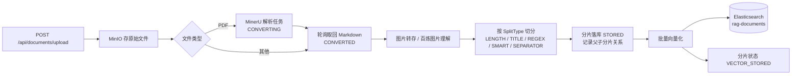
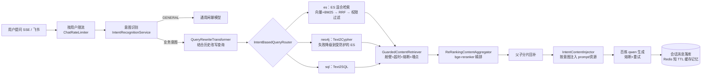

# rag-langchain4j

面向企业客服场景的 RAG（检索增强生成）服务。文档入库后可通过 Web 页面或飞书机器人提问，回答前先做意图识别、多源检索、重排序，并按用户权限级别过滤知识片段。

核心能力：

- **多源检索**：Elasticsearch 向量 + BM25 混合检索（RRF 融合）、Neo4j 知识图谱（Text2Cypher）、MySQL 结构化数据（Text2SQL）
- **意图路由**：LLM 识别问题意图，按意图选择检索源组合与提示词模板
- **查询改写**：结合多轮上下文把口语化提问改写为适合检索的查询
- **本地重排序**：ONNX 版 bge-reranker 精排，无需额外调用外部 API
- **父子分片召回**：命中子分片时回补父分片/兄弟分片，保证上下文完整
- **权限分级**：知识文档带 `accessibleBy`，检索结果按用户级别过滤
- **稳定性**：按用户/IP 限流，大模型调用熔断重试，检索源超时隔离与降级
- **可观测**：Micrometer + Prometheus 暴露检索延迟、命中率、降级次数、流水线各环节计数
- **飞书机器人**：群聊 @ 提问，卡片消息返回答案与引用来源

## 目录

- [架构与主链路](#架构与主链路)
- [技术栈](#技术栈)
- [模块划分](#模块划分)
- [外部依赖组件](#外部依赖组件)
- [快速开始](#快速开始)
- [配置项说明](#配置项说明)
- [接口一览](#接口一览)
- [权限模型](#权限模型)
- [限流与降级](#限流与降级)
- [监控指标](#监控指标)
- [运行测试](#运行测试)
- [已知限制与常见坑](#已知限制与常见坑)

## 架构与主链路

### 链路一：文档入库

由 Spring 事件驱动，三个定时任务作为异常兜底（重启、事件丢失时补齐遗留文档）。



文档状态机：`UPLOADED → CONVERTING →（CONVERTED）→ CHUNKED → VECTOR_STORED`，任一环节异常置 `FAILED`。
兜底任务：`MineruParseTask`（轮询 CONVERTING）、`ConvertedDocumentProcessTask`（补处理 CONVERTED）、`VectorStoreTask`（补向量化 CHUNKED）。

### 链路二：检索问答



意图与检索源组合（`RagConfig#intentQueryRouter`，提示词模板见 `src/main/resources/prompt/`）：

| 意图 | 检索源 | 提示词 |
|---|---|---|
| `PRE_SALES` 售前咨询 | ES + Neo4j | `pre_sales.txt` |
| `POST_SALES` 售后问题 | ES | `post_sales.txt` |
| `PRICE_INQUIRY` 价格咨询 | ES + Neo4j + SQL | `price_inquiry.txt` |
| `SYSTEM_OPERATION` 系统操作 | ES | `system_operation.txt` |
| `GENERAL` 通用闲聊 | 不检索，直接走通用模型 | `general.txt` |

## 技术栈

| 组件 | 版本 | 用途 |
|---|---|---|
| Java | 21 | 语言级别，使用虚拟线程处理飞书消息 |
| Spring Boot | 3.5.6 | Web / 配置 / Actuator |
| langchain4j（core/open-ai） | 1.19.0（BOM） | RAG 编排、模型适配 |
| langchain4j 扩展模块 | 1.19.0-beta29 | elasticsearch、community-neo4j-retriever、experimental-sql、onnx-scoring、spring-boot-starter |
| elasticsearch-java | 9.3.1 | ES 客户端（BM25 查询、索引管理） |
| MyBatis-Plus | 3.5.9 | ORM，逻辑删除 |
| Druid | 1.2.24 | 连接池、慢 SQL 统计与监控页 |
| Redisson | 3.52.0 | Redis 客户端、分布式限流、分片缓存 |
| Sa-Token | 1.39.0 | 登录态与路由拦截 |
| Resilience4j | 2.2.0 | 熔断、重试、舱壁（编程式，未走 AOP） |
| Micrometer + Prometheus | 随 Boot | 指标暴露 |
| MinIO SDK / Tika / fastexcel | - / 3.1.0 / 1.3.0 | 对象存储、文件识别、Excel 解析 |
| Testcontainers | 随 Boot | 集成测试起真实中间件 |

## 模块划分

```
src/main/java/com/lujia/rag/raglangchain4j/
├── auth/       登录、访客、用户级别枚举、Sa-Token 拦截与全局异常
├── chat/       会话与消息、RAG 装配（config/RagConfig）、RAG 组件（rag/*）
├── document/   上传、MinerU、切分器、分片、向量化存储、事件与兜底任务
├── feishu/     飞书事件回调、消息处理、卡片构造
└── common/
    ├── config/      BailianModelFactory（模型实例工厂）、BailianProperties
    ├── ratelimit/   ChatRateLimiter（Redisson 令牌桶）
    ├── resilience/  BailianResilience + ResilientChatModel/ResilientStreamingChatModel
    └── metrics/     RagMetrics（自定义业务指标）
```

`chat/rag/` 下的关键类：`QueryRewriteTransformer`（查询改写）、`IntentBasedQueryRouter`（意图路由）、`HybridSearchContentRetriever`（混合检索 + 父子分片回补）、`GuardedContentRetriever`（检索源防护）、`FallbackContentRetriever`（降级兜底）、`DbBackedChatMemory` + `ChatMemoryCache`（DB 持久化记忆 + Redis 缓存）、`IntentContentInjector`（按意图注入提示词）、`OnnxScoringModelHolder`（重排模型单例）。

## 外部依赖组件

| 组件 | 默认地址 | 必需 | 说明 |
|---|---|---|---|
| MySQL 8 | localhost:3306/rag_db | 是 | 文档、分片、会话、消息、用户 |
| Redis | localhost:6379 | 是 | 限流令牌桶、分片缓存、Sa-Token 会话 |
| Elasticsearch 9 | localhost:9200 | 是 | 向量 + BM25 检索，索引名 `rag-documents` |
| MinIO | localhost:9000 | 是 | 原始文件与解析结果，桶名 `rag-documents` |
| Neo4j 5 | bolt://localhost:7687 | 否 | 图谱检索；无数据或不可用时自动降级到 ES |
| 阿里百炼 | dashscope | 是 | 生成、意图识别、改写、Embedding |
| MinerU | https://mineru.net | 处理 PDF 时需要 | 版面解析 |
| 飞书开放平台 | - | 接入机器人时需要 | 事件回调 + 消息卡片 |

## 快速开始

### 1. 准备中间件

用 Docker 起 MySQL / Redis / Elasticsearch / MinIO（Neo4j 可选），端口与上表默认值一致即可。

### 2. 初始化表结构

```bash
mysql -uroot -p < src/main/resources/init.sql
```

脚本建 6 张表：`user_info`、`rag_knowledge_document`、`knowledge_document_segment`、`rag_chat_conversation`、`rag_chat_message`、`feishu_conversation_mapping`。

### 3. 创建 ES 索引（必须手工执行）

仓库内**没有**生产索引 mapping，代码也不会自动建索引；索引不存在时检索会失败并降级为空结果。

字段名有硬约束：langchain4j 的 `ElasticsearchConfigurationKnn` 固定读取向量字段 `vector`，正文与元数据分别用 `text`、`metadata`。`dims` 必须与 Embedding 模型输出维度一致（`text-embedding-v3` 默认 1024）。

```bash
curl -X PUT http://localhost:9200/rag-documents -H 'Content-Type: application/json' -d '{
  "mappings": {
    "properties": {
      "vector": {"type": "dense_vector", "dims": 1024, "index": true, "similarity": "cosine"},
      "text": {"type": "text"},
      "metadata": {"type": "object"}
    }
  }
}'
```

MinIO 桶无需手工创建，应用启动时 `MinioConfig` 会检查并按需创建 `rag-documents`。

### 4. 填写配置

编辑 `src/main/resources/application.yml`，把所有占位值替换为真实凭据：`bailian.api-key`、`embedding.api-key`、`mineru.token`、`feishu.*`，以及数据源/Redis/MinIO/Neo4j 的账号密码。

**强烈建议不要把这些值提交进仓库**，改用环境变量或配置中心注入，例如：

```bash
export BAILIAN_API_KEY=sk-xxxx
export SPRING_DATASOURCE_PASSWORD=yyyy
```

同时改掉 Druid 监控页口令（`spring.datasource.druid.stat-view-servlet.login-username/-password`），默认值仅适合本地。

### 5. 启动与验证

```bash
mvn spring-boot:run                     # 或 mvn package 后 java -jar target/*.jar
```

| 验证项 | 地址 |
|---|---|
| 登录页（内置静态页） | http://localhost:8080/login.html |
| 问答页 | http://localhost:8080/chat.html |
| 文档管理页 | http://localhost:8080/document.html |
| 分片查询页 | http://localhost:8080/segment.html |
| 健康检查 | http://localhost:8080/actuator/health |
| Prometheus 指标 | http://localhost:8080/actuator/prometheus |
| Druid 监控 | http://localhost:8080/druid/ |

冒烟顺序建议：`POST /api/test/upload-and-process`（走完整入库链路）→ `GET /api/test/progress/{documentId}` → `GET /api/test/search?query=...` → 页面提问。
`/api/test/**` 是联调用的驱动接口，生产部署应在网关层关闭。

## 配置项说明

| 配置 | 默认值 | 说明 |
|---|---|---|
| `bailian.model` | qwen-vl-max | 图片内容识别模型 |
| `bailian.rag-model` | qwen-plus | RAG 生成模型 |
| `bailian.general-model` | qwen-plus | 通用闲聊模型 |
| `bailian.title-model` | qwen-turbo | 会话标题摘要模型 |
| `embedding.model` | text-embedding-v3 | Embedding 模型，决定 ES `dims` |
| `elasticsearch.index-name` | rag-documents | 检索与写入索引 |
| `minio.bucket-name` | rag-documents | 对象存储桶 |
| `minio.external-endpoint` | - | 卡片/前端可访问的地址，用于替换内部 `localhost` |
| `rag.retrieval.timeout-seconds` | 5 | 单检索源超时，超时降级为空结果 |
| `rag.chat.rate-limit-permits` | 10 | 限流窗口内允许次数；变更后自动重置速率桶 |
| `rag.chat.rate-limit-seconds` | 10 | 限流窗口长度（秒） |
| `rag.memory-cache-ttl-seconds` | 60 | 会话历史 Redis 缓存 TTL |
| `sa-token.timeout` | 86400 | 登录态有效期（秒） |
| `spring.servlet.multipart.max-file-size` | 100MB | 上传大小上限 |

检索内部参数（未外置为配置）：混合检索 `maxResults=5`、`minScore=0.7`；RAG 记忆窗口 20 条；意图识别记忆 10 条。改这些需要动 `RagConfig`。

## 接口一览

鉴权：Sa-Token 拦截 `/api/**`，仅放行 `/api/auth/login`、`/api/auth/visitor`、`/api/feishu/**`。登录后请求需带 header `satoken: <token>`。

| 方法 | 路径 | 说明 |
|---|---|---|
| POST | `/api/auth/login` `/api/auth/visitor` `/api/auth/logout` `/api/auth/reset-password` | 登录 / 访客登录 / 登出 / 改密 |
| GET | `/api/auth/current` | 当前登录用户 |
| POST | `/api/chat/conversations` | 创建会话 |
| GET | `/api/chat/conversations` `/api/chat/conversations/{id}/messages` | 会话列表 / 历史消息 |
| POST | `/api/chat/conversations/{id}/messages/stream` | 发消息，SSE 流式返回：逐 token 的 data 事件、RAG 管道进度 data 事件、引用 data 事件（以 `[RAG_REFERENCES]` 前缀）、`done` 命名事件（messageId / modelName / tokenCount） |
| DELETE | `/api/chat/conversations/{id}` | 删除会话 |
| POST | `/api/documents/upload` | 上传文档（含切分参数） |
| GET/DELETE | `/api/documents/{id}` `/api/documents/list` `/api/documents/page` `/api/documents/batch` | 文档查询与删除 |
| 同上 | `/api/segments/**` | 分片查询与删除 |
| POST | `/api/test/upload-and-process` `/api/test/vectorize/{documentId}` | 联调：整链路处理 / 单文档向量化 |
| GET | `/api/test/progress/{documentId}` `/api/test/search` | 联调：处理进度 / 裸检索（`query`、`maxResults`、`minScore`，不传权限级别即不做权限过滤） |
| POST | `/api/feishu/event` | 飞书事件回调（订阅消息，需配置地址与校验 token） |

飞书机器人支持 `/reset`（或 `新对话`）重置会话、`/help`（或 `帮助`）查看说明；群聊中只回复 @机器人 的消息。

## 权限模型

`UserType` 三级，级别越高可见范围越大：`VISITOR(1)`、`CUSTOMER(2)`、`STAFF(3)`。文档在 `rag_knowledge_document.accessible_by` 上标注最低可见级别（`POST /api/documents/upload` 的 `accessibleBy` 参数默认 `STAFF`），向量化时写入分片 metadata 的 `accessibleBy`。

检索侧规则（`VectorStoreService`）：

1. 权限过滤发生在 **top-N 截断之前**，两路检索各超量取回 3 倍候选（`PERMISSION_OVERFETCH`），避免无权文档挤掉名额；
2. 向量与 BM25 两路都要带出 metadata，否则无法判定级别；
3. **判不出级别即 fail-closed**：metadata 缺失或没有 `accessibleBy` 的分片只放行 STAFF。

注意 `accessible_by NOT NULL DEFAULT 'STAFF'`：新建文档漏填权限会被数据库补成 STAFF（最严格），而不是放开。

## 限流与降级

一次提问的保护顺序：

| 环节 | 实现 | 触发后行为 |
|---|---|---|
| 请求配额 | `ChatRateLimiter`（Redisson `RRateLimiter`，key `ratelimit:chat:<桶>`） | 抛 `RateLimitExceededException`，返回"请求过于频繁"；同步与流式两个入口都生效，飞书走的也是同步入口 |
| 分桶优先级 | 登录用户 `u:<id>` > 客户端 IP `ip:<addr>` > 会话 `conv:<id>` > 共享 `shared` | 避免会话 ID 被用作绕过的口子 |
| 意图识别 | `recognizeIntentSafely` | 识别异常时降级为 `GENERAL`，即只走通用闲聊、不查知识库 |
| 检索并发/超时 | `GuardedContentRetriever` + 舱壁（并发 20，不等待）+ `rag.retrieval.timeout-seconds` | 超时/满舱 → 该源返回空结果并计一次失败 |
| 检索熔断 | 命名空间 `retrieval-<源>`（es / neo4j / sql），窗口 20 / 最小 10 次 / 失败率或慢调用（>10s）50% 开启 / 开 15s / 半开 3 次 | 快速失败，不再打后端 |
| Neo4j 兜底 | `FallbackContentRetriever` 转投**受防护的** ES | 记 `rag.retrieval.fallback{source}` |
| 大模型调用 | `ResilientChatModel` / `ResilientStreamingChatModel`，重试 3 次间隔 1s；熔断 `bailian-<model>`：窗口 10 / 最小 5 次 / 失败率或慢调用（>60s）50% / 开 30s / 半开 3 次 | 熔断开启时不再重试；流式调用按**真实完成或报错**计数，而非仅按发起计数 |

## 监控指标

抓取 `/actuator/prometheus`。自定义业务指标（`RagMetrics`）：

| 指标 | 类型 | 标签 | 含义 |
|---|---|---|---|
| `rag_retrieval_seconds_*` | Timer | `source` | 各检索源单次检索耗时 |
| `rag_retrieval_hit_total` | Counter | `source`,`hit` | 各检索源命中率 |
| `rag_retrieval_fallback_total` | Counter | `source` | 主源失败转投兜底源的次数 |
| `rag_chat_intent_total` | Counter | `intent` | 意图分布 |
| `rag_pipeline_stage_total` | Counter | `stage`,`result` | 入库流水线各环节成功/失败计数 |

框架指标：`resilience4j_circuitbreaker_*`（按 `bailian-*` / `retrieval-*` 区分）、`resilience4j_retry_*`、`resilience4j_bulkhead_*`，以及 JVM、HTTP Server、Druid 自带指标。

建议告警：`rag_retrieval_fallback_total` 速率突增、`retrieval-es` 断路器 `state=OPEN`、`rag_pipeline_stage_total{result="failure"}` 持续增长。

## 运行测试

需要本机可用的 Docker（Testcontainers 会拉起 MySQL / Redis / Elasticsearch 9.2.8 / MinIO）。

```bash
mvn test                    # 全部 13 个用例
mvn -o test -Dtest=FullPipelineIntegrationTest   # 只跑全链路集成测试
```

- `FullPipelineIntegrationTest`：覆盖上传→向量化→检索问答、权限过滤、状态流转、仅 BM25 命中场景等 7 个用例，每个用例前重建 ES 索引并清空测试库。
- `ResilientStreamingChatModelTest`：5 个纯单测，验证流式调用熔断按真实结果计数。
- 测试用 `FakeEmbeddingModel`（8 维确定性向量）替代真实百炼 Embedding，LLM 由 `TestAiConfig` 里的 Mockito bean 提供，因此不消耗 API 额度。

## 已知限制与常见坑

- **权限过滤在应用层，未下推 ES**：ES 侧 `metadata.accessibleBy` 的 terms 过滤需要先确认生产索引存在 `metadata.accessibleBy.keyword` 子字段，否则查询会静默返回 0 条。改动前请用 `GET /rag-documents/_mapping` 核对。
- **访客共用限流桶**：访客登录共用同一账号（`visitor_000`），因此落到同一个 `u:` 桶。按访客维度分桶需要先做访客身份改造。
- **反向代理下的 IP**：`ChatRateLimiter` 只读 `request.getRemoteAddr()`，故意不读 `X-Forwarded-For`（该头可伪造，读了等于送出绕过限流的口子）。走 Nginx 部署时请配置 `server.forward-headers-strategy: framework` 并保证代理层可信。
- **Neo4j 无数据不影响启动**：图谱检索失败会降级到 ES，但若从未导入图谱，`PRE_SALES` / `PRICE_INQUIRY` 意图等于多绕一次空查询，建议按需关掉该路由分支。
- **重排序模型随包分发**：`src/main/resources/bge/model_quantized.onnx` 启动时解压到临时目录加载，首次加载有秒级耗时；jar 体积也因此偏大。
- **Druid 监控页与明文配置**：仓库默认口令仅供本地，务必改口令或在生产环境关闭 `stat-view-servlet`；`application.yml` 里的凭据不应保留真实值。
- **`/api/test/**` 是联调接口**：可绕过正常流程直接触发向量化与裸检索，生产环境应在网关层屏蔽。
